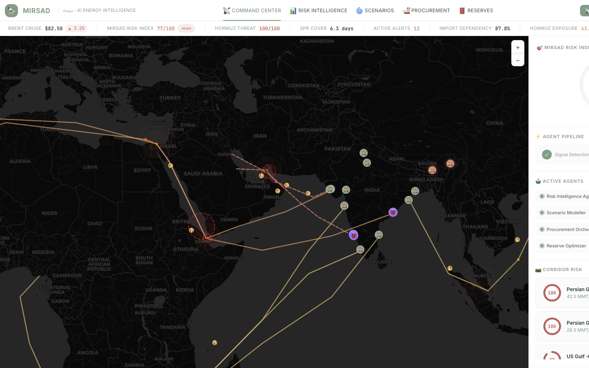
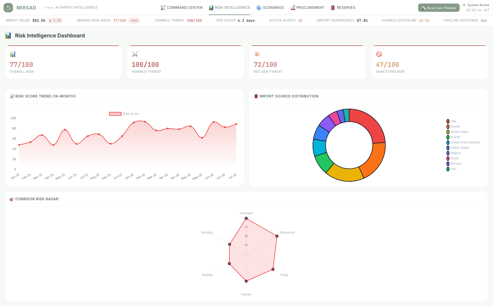
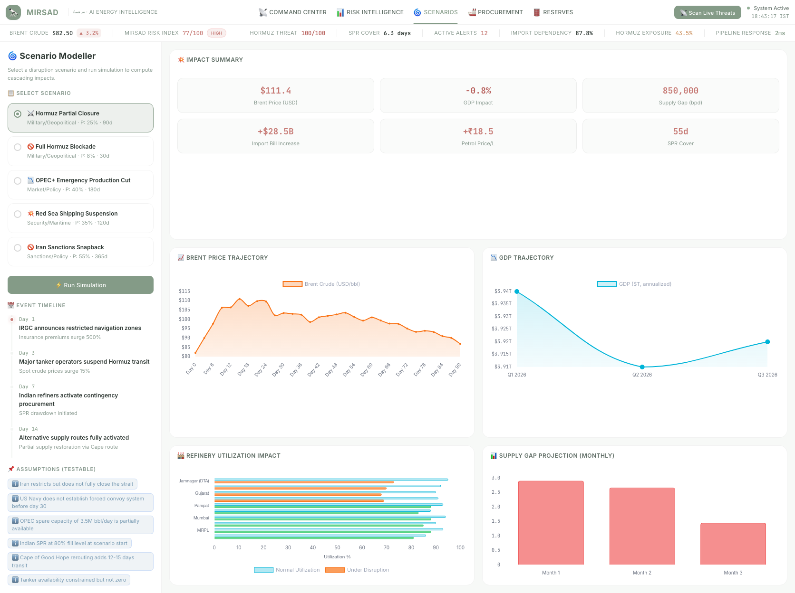
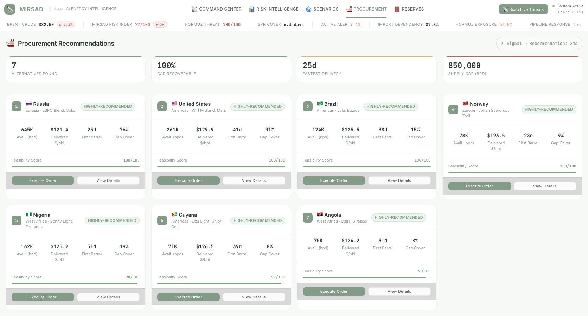
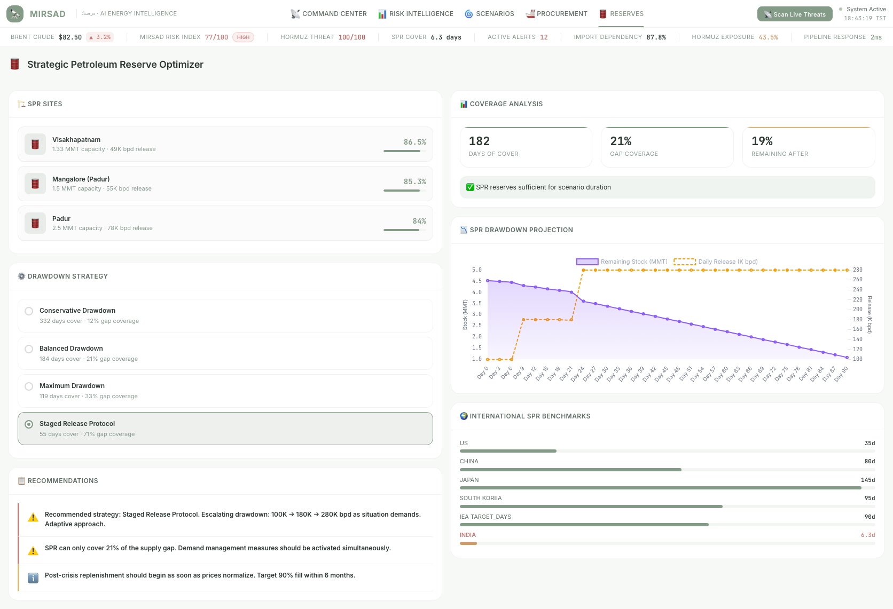

<div align="center">

# 🔭 MIRSAD (مرصاد)

### AI-Powered Energy Supply Chain Resilience Platform

*Real-time geopolitical risk monitoring & disruption scenario modeling for India's crude oil security*

[](https://python.org)
[](https://fastapi.tiangolo.com)
[](https://langchain-ai.github.io/langgraph/)
[](https://aistudio.google.com)
[](https://leafletjs.com)
[](https://www.chartjs.org)

</div>

---

## 📋 Table of Contents

- [The Problem](#-the-problem)
- [The Solution](#-the-solution)
- [Screenshots](#-screenshots)
- [Key Features](#-key-features)
- [System Architecture](#-system-architecture)
- [Tech Stack](#️-tech-stack)
- [Real Data Sources](#-real-data-sources)
- [Installation & Setup](#-installation--setup)
- [Usage](#-usage)
- [Project Structure](#-project-structure)
- [License](#-license)

---

## 🔴 The Problem

India is the **world's third-largest crude oil consumer** at 5.35 million barrels per day, yet produces less than 13% domestically. This extreme import dependency creates a cascading vulnerability:

| Metric | Value | Risk Implication |
|--------|-------|------------------|
| Import dependency | **87.3%** | Near-total reliance on foreign supply |
| Hormuz transit share | **~58%** | Single 33km-wide chokepoint |
| Top 3 supplier concentration | **~58%** | Iraq, Russia, Saudi Arabia |
| Annual import bill | **~$120B** | Every $10/bbl increase → ~$18B outflow |
| SPR coverage | **~10 days** | Far below IEA 90-day recommendation |

**Current tools fail** because they treat news monitoring, price tracking, and supply planning as separate workflows. A crisis in the Strait of Hormuz impacts all three simultaneously — analysts must manually synthesize across disconnected systems.

---

## 💡 The Solution

MIRSAD (*مرصاد*, Arabic for "watchtower") fuses **live data from multiple independent sources** through a **9-node LangGraph AI pipeline** with **RAG-grounded analysis** to produce:

- ✅ Quantitative risk scores (0–100) with cited sources
- ✅ Predictive 7-day and 30-day risk trajectories (EWMA-based)
- ✅ Deterministic supply security metrics (SSI, HHI, DoA, PSI)
- ✅ Disruption war-gaming with cascading economic impact simulation
- ✅ Automated procurement re-ranking and SPR drawdown optimization

**Key differentiator:** Unlike static dashboards, MIRSAD connects signal ingestion → risk analysis → scenario simulation → procurement action in a single integrated pipeline. No human context-switching required.

---

## 📸 Screenshots

### Command Center
> Interactive Leaflet map showing supply routes, refineries, chokepoints, SPR sites, and risk zones with a real-time sidebar for risk gauges, alert feeds, and corridor overview.



### Risk Intelligence
> Corridor-by-corridor risk breakdown with severity badges, geopolitical event catalog sourced from live news, and multi-dimensional risk scoring powered by the LangGraph pipeline.



### Scenario Modeller
> Pre-configured disruption war-games (Hormuz closure, Red Sea blockade, Russia sanctions, OPEC cuts) with tabbed Chart.js visualizations for Brent price trajectory, GDP impact, refinery utilization, and supply gap projections.



### Procurement Orchestrator
> Alternative supplier ranking by delivered cost, tanker class availability, and rerouting recommendations that automatically adapt to the active crisis scenario.



### Reserve Optimizer
> SPR drawdown strategy across India's three strategic reserve sites (Visakhapatnam, Mangalore, Padur) with site-level coverage analysis and days-of-autonomy tracking.



---

## 🌟 Key Features

### 📡 Multi-Source Data Fusion
Ingests news articles, commodity prices, vessel transit signals, FX rates, and a curated fact corpus into a single analysis context. No reliance on any single data source.

### 🎯 Predictive Risk Trajectory
EWMA-based 7-day and 30-day risk forecasts combining event momentum, vessel congestion deviation, and commodity price signals with explicit confidence bands.

### 📊 Quantitative Metrics Suite
Four deterministic, LLM-independent metrics — each with published formulas:

| Metric | Formula | What It Measures |
|--------|---------|------------------|
| **SSI** (Supply Security Index) | `0.35×(SPR/90) + 0.30×(1−HHI) + 0.20×route_div + 0.15×(1−hormuz_dep)` | Composite resilience score (0–100) |
| **HHI** (Herfindahl-Hirschman) | `Σ(share_i²)` | Supplier concentration |
| **DoA** (Days of Autonomy) | `(SPR + in_transit + contracted) / daily_consumption` | Days India can sustain without new procurement |
| **PSI** (Price Sensitivity) | `β × import_dep × (1 − hedge_ratio)` | Retail fuel price exposure to Brent changes |

### 🔄 Multi-LLM Key Rotation
Circular-queue rotation pool across Gemini, Grok, and OpenAI with per-key daily limits, automatic cooldown on 429 errors, and graceful fallback to formula-based scoring when all keys are exhausted.

### 📚 RAG Fact-Grounding
ChromaDB vector store (`all-MiniLM-L6-v2` embeddings) with **80+ curated facts** from PPAC, ISPRL, EIA, and refinery databases. Every LLM call must cite its facts and flag extrapolations — preventing hallucination of India-specific statistics.

### ⚔️ Disruption War-Gaming
Pre-configured disruption scenarios with cascading impact simulation across supply gaps, GDP, refinery utilization, and Brent price trajectories.

---

## ⚙️ System Architecture

MIRSAD uses a **hybrid multi-agent architecture** with a Python backend for AI/data processing and a JavaScript frontend for real-time visualization.

```
┌─────────────────────────────────────────────────────────────────────┐
│                    FRONTEND — Browser SPA (Vanilla JS)              │
│  ┌──────────┐ ┌──────────┐ ┌──────────┐ ┌──────────┐ ┌──────────┐ │
│  │ Command  │ │  Risk    │ │ Scenario │ │Procure-  │ │ Reserve  │ │
│  │ Center   │ │  Intel   │ │ Modeller │ │  ment    │ │Optimizer │ │
│  │(Leaflet) │ │ (Agent)  │ │(Chart.js)│ │(Agent)   │ │ (Agent)  │ │
│  └──────────┘ └──────────┘ └──────────┘ └──────────┘ └──────────┘ │
└────────────────────────────┬────────────────────────────────────────┘
                             │ POST /api/analyze-risk
                             ▼
┌─────────────────────────────────────────────────────────────────────┐
│              BACKEND — FastAPI + LangGraph Pipeline                  │
│                                                                     │
│  ┌──────────┐  ┌──────────┐  ┌──────────┐  ┌──────────┐           │
│  │fetch_news│→ │fetch_    │→ │fetch_    │→ │retrieve_ │           │
│  │(NewsAPI) │  │commodity │  │vessel    │  │facts     │           │
│  │          │  │(yfinance)│  │(AIS base)│  │(ChromaDB)│           │
│  └──────────┘  └──────────┘  └──────────┘  └──────────┘           │
│       ↓                                         ↓                  │
│  ┌──────────┐  ┌──────────┐  ┌──────────┐  ┌──────────┐           │
│  │analyze_  │→ │predict_  │→ │compute_  │→ │assess_   │→ compile  │
│  │risk ✦    │  │trajectory│  │metrics   │  │economic✦ │   report  │
│  │(LLM+RAG)│  │(EWMA)    │  │(SSI,HHI) │  │(LLM)    │           │
│  └──────────┘  └──────────┘  └──────────┘  └──────────┘           │
│                                                                     │
│  ✦ = LLM-powered (via multi-key rotation pool)                     │
│  Infrastructure: LLM Pool │ ChromaDB Vector Store │ File Cache     │
└─────────────────────────────────────────────────────────────────────┘
```

### 9-Node LangGraph Pipeline

| # | Node | Type | Input | Output |
|---|------|------|-------|--------|
| 1 | `fetch_news` | Data | topic string | Live articles (NewsAPI) |
| 2 | `fetch_commodity_prices` | Data | — | Brent/WTI with 1d/7d/30d changes |
| 3 | `fetch_vessel_signals` | Data | — | Chokepoint congestion (6 points) |
| 4 | `retrieve_facts` | RAG | topic + summaries | Top-8 facts from ChromaDB |
| 5 | `analyze_risk` | **LLM** | news + facts + vessels | Risk score (0–100), citations |
| 6 | `predict_trajectory` | Compute | risk score + signals | 7d/30d forecast + confidence |
| 7 | `compute_metrics` | Compute | Brent price + inputs | SSI, HHI, DoA, PSI |
| 8 | `assess_economic` | **LLM** | risk + prices + metrics | Economic impact estimate |
| 9 | `compile_report` | Aggregation | all state fields | Comprehensive JSON report |

---

## 🛠️ Tech Stack

<table>
<tr><td><b>Layer</b></td><td><b>Technology</b></td></tr>
<tr><td>Frontend Core</td><td>HTML5, CSS3 (Vanilla design tokens, CSS Grid), JavaScript (ES6 Modules)</td></tr>
<tr><td>Mapping</td><td>Leaflet.js v1.9.4</td></tr>
<tr><td>Charts</td><td>Chart.js v4.4.4</td></tr>
<tr><td>Icons</td><td>Lucide Icons (SVG)</td></tr>
<tr><td>Fonts</td><td>Inter, JetBrains Mono (Google Fonts)</td></tr>
<tr><td>Backend Framework</td><td>FastAPI + Uvicorn</td></tr>
<tr><td>AI Pipeline</td><td>LangGraph + LangChain Core</td></tr>
<tr><td>LLM Providers</td><td>Gemini 2.0 Flash, Grok 3 Mini, GPT-4o Mini (via rotation pool)</td></tr>
<tr><td>Vector Store</td><td>ChromaDB + all-MiniLM-L6-v2 (SentenceTransformers)</td></tr>
<tr><td>Commodity Data</td><td>yfinance (BZ=F, CL=F tickers)</td></tr>
<tr><td>News Feed</td><td>NewsAPI.org</td></tr>
<tr><td>FX Rates</td><td>Frankfurter.app (ECB data)</td></tr>
</table>

---

## 📡 Real Data Sources

Every data point in MIRSAD is sourced from a real, verifiable public API or calibrated dataset. **No mock or fabricated data.**

| Data | Provider | API Key? | Cache TTL |
|------|----------|----------|-----------|
| Crude oil prices (Brent/WTI) | yfinance | No | 1 hour |
| Geopolitical news | NewsAPI.org | Yes (free tier) | Per query |
| INR/USD exchange rate | Frankfurter.app (ECB) | No | 4 hours |
| Vessel congestion baselines | EIA / public AIS data | No | Static |
| 23 Indian refineries | PPAC / company filings | No | Static |
| 3 SPR sites | ISPRL public disclosures | No | Static |
| 10 supplier countries | PPAC import statistics | No | Static |
| 8 maritime corridors | EIA / shipping databases | No | Static |
| 80+ RAG facts | Curated from above sources | No | Embedded |

> **Transparency note on vessel data:** Free public AIS APIs with adequate rate limits do not exist. MIRSAD uses calibrated baselines from EIA and public port authority reports with simulated real-time deviations. The pipeline is architecturally ready to plug into a real AIS feed (e.g., MarineTraffic, Kpler).

---

## 🚀 Installation & Setup

### Prerequisites
- Python 3.10+
- A web browser (Chrome recommended)
- API Keys:
  - [Google Gemini API Key](https://aistudio.google.com/) (required — at least 1)
  - [NewsAPI Key](https://newsapi.org/register) (required for live news)

### 1. Clone the Repository
```bash
git clone https://github.com/Abrar0604/mirsad-energy-intel.git
cd mirsad-energy-intel
```

### 2. Backend Setup
```bash
cd backend

# Create and activate virtual environment
python3 -m venv venv
source venv/bin/activate  # Windows: venv\Scripts\activate

# Install dependencies
pip install -r requirements.txt

# Configure environment variables
cp .env.example .env
# Edit .env and add your API keys:
#   NEWS_API_KEY="your_newsapi_key"
#   LLM_POOL_1_PROVIDER="gemini"
#   LLM_POOL_1_KEY="your_gemini_api_key"
#   LLM_POOL_1_MODEL="gemini-2.0-flash"
#   LLM_POOL_1_DAILY_LIMIT=1500

# Start the FastAPI backend
uvicorn main:app --host 0.0.0.0 --port 8000
```

### 3. Frontend Setup
```bash
# In a new terminal, from the project root
python3 -m http.server 8080
```

### 4. Access the Platform
Open your browser and navigate to: **http://localhost:8080**

---

## 🧪 Usage

1. **Live Scanning**: Click **"Scan Live Threats"** in the top navigation bar. The system triggers the full 9-node LangGraph pipeline: fetches real-world news, pulls live Brent/WTI prices, retrieves RAG facts, and produces a grounded risk assessment. Results populate across all five dashboard views.

2. **War-Gaming**: Navigate to the **Scenarios** tab and select a pre-configured disruption (e.g., *Hormuz Partial Closure*). Watch how the Brent price trajectory, supply gap, refinery utilization, and GDP impact cascade in real-time. The Procurement and Reserve agents automatically adapt their recommendations.

3. **Exploring Data**: Each tab (Risk Intelligence, Procurement, Reserves) is populated with data from the last live scan. The data persists across page reloads via `localStorage`.

---

## 📁 Project Structure

```
MIRSAD/
├── index.html                          # SPA entry point
├── css/
│   ├── design-system.css               # Design tokens, typography, colors
│   ├── layout.css                      # Grid layouts, navigation
│   ├── components.css                  # Cards, badges, toasts, tables
│   ├── dashboard.css                   # View-specific styles
│   └── map.css                         # Leaflet map overrides
├── js/
│   ├── app.js                          # Main application controller
│   ├── agents/
│   │   ├── agent-coordinator.js        # Pipeline orchestrator (API bridge)
│   │   ├── risk-intelligence.js        # Multi-source risk scoring engine
│   │   ├── scenario-modeller.js        # Disruption simulation engine
│   │   ├── procurement-orchestrator.js # Supplier ranking & rerouting
│   │   └── reserve-optimizer.js        # SPR drawdown strategy
│   ├── data/
│   │   ├── geopolitical-events.js      # Event catalog (from public sources)
│   │   ├── supply-routes.js            # 8 maritime corridors (EIA data)
│   │   ├── refineries.js              # 23 Indian refineries (PPAC data)
│   │   ├── suppliers.js               # 10 supplier countries (PPAC data)
│   │   ├── scenarios.js               # Disruption scenario configs
│   │   └── spr-data.js                # SPR sites (ISPRL data)
│   └── visualization/
│       ├── map-engine.js              # Leaflet map controller
│       ├── charts.js                  # Chart.js wrapper
│       └── animations.js             # Micro-animation engine
├── backend/
│   ├── main.py                        # FastAPI server & CORS config
│   ├── agents/
│   │   ├── graph.py                   # 9-node LangGraph pipeline
│   │   ├── llm_pool.py                # Multi-LLM key rotation pool
│   │   ├── fact_store.py              # ChromaDB RAG vector store
│   │   ├── fact_corpus.py             # 80+ curated ground-truth facts
│   │   ├── metrics.py                 # SSI, HHI, DoA, PSI formulas
│   │   ├── news_tool.py              # NewsAPI integration
│   │   ├── commodity_tool.py          # yfinance Brent/WTI fetcher
│   │   ├── vessel_tool.py            # AIS chokepoint signal generator
│   │   ├── fx_tool.py                # INR/USD FX rate (Frankfurter)
│   │   └── state.py                  # AgentState TypedDict schema
│   ├── .env.example                   # Environment variable template
│   ├── requirements.txt               # Python dependencies
│   ├── cache/                         # File-based cache (auto-created)
│   └── chroma_db/                     # Persistent vector store
└── docs/
    └── screenshots/                   # UI screenshots for documentation
```

---

## 📝 License

Proprietary — Developed for Energy Intelligence & Supply Chain Resilience.

---

<div align="center">

**MIRSAD** — مرصاد — *Built for energy resilience, powered by AI.*

</div>
